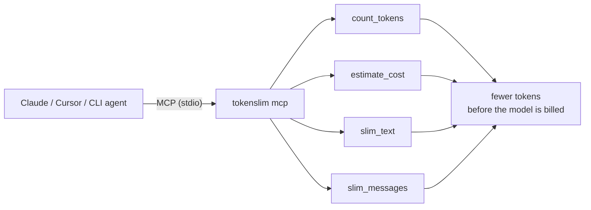

# tokenslim 🪶

[](https://github.com/himanshudhawale/tokenslim/actions/workflows/ci.yml)
[](https://www.python.org/)
[](LICENSE)

> Shrink the token cost of the context you feed to LLMs — **count tokens, estimate cost, and slim files before you send them.** Plugs straight into Claude, Cursor and any agent via a built-in **MCP server**.

LLM-powered tools (Copilot CLI, Claude Code, Cursor, your own scripts) bill you for **every token** of context. Most of that context is waste: comments, blank lines, trailing whitespace, boilerplate. `tokenslim` measures it and trims it — and shows you exactly how much money you saved.

Works **fully offline** with a built-in token estimator. Install the optional `accurate` extra to use real `tiktoken` counts.

## 📉 See your savings

A real example — slimming a few source files before sending them as LLM context:

```mermaid
---
config:
  xyChart:
    width: 720
    height: 360
---
xychart-beta
    title "Tokens before vs. after tokenslim (lower is cheaper)"
    x-axis ["app.py", "utils.py", "config.yaml", "main.js", "README.md"]
    y-axis "Tokens" 0 --> 500
    bar [412, 188, 96, 320, 440]
    bar [268, 121, 71, 205, 312]
```



<sub>🟦 before &nbsp; 🟧 after — **~32% fewer tokens** on average, paid on every single call.</sub>

---

## Why

- 💸 **See the cost before you pay it.** Get a per-model price for any file or pasted text.
- ✂️ **Cut the waste.** Strip comments and collapse whitespace with language-aware, conservative transforms.
- 🔌 **Pipe-friendly.** Drop it into any shell workflow.
- 📦 **Zero required dependencies.** One `pip install` and you're running.

## Install

```bash
pip install tokenslim
# optional: accurate counts via tiktoken
pip install "tokenslim[accurate]"
```

## Usage

**Count tokens and estimate cost:**

```bash
tokenslim count src/app.py src/utils.py
```

```
       412  src/app.py
       188  src/utils.py
       600  TOTAL

Cost estimate for 600 input tokens:
  gpt-4o            in     $0.0015   out     $0.0060
  gpt-4o-mini       in   $0.000090   out   $0.000360
  claude-sonnet     in     $0.0018   out     $0.0090
  ...
```

**Slim a file and see the savings:**

```bash
tokenslim slim src/app.py > app.slim.py
# src/app.py: 412 -> 268 tokens (35.0% saved)
```

**Pipe straight from stdin (force a language with `--ext`):**

```bash
cat big.py | tokenslim slim --ext .py | pbcopy
```

**Rewrite files in place:**

```bash
tokenslim slim -i src/**/*.py
```

**Guard your context size in CI** (fails the build if a file/bundle is too expensive):

```bash
tokenslim count --budget 8000 prompts/system.md context/*.py
# exits 2 and prints "OVER BUDGET by N tokens" when the limit is exceeded
```

### Options

| Flag | Description |
|------|-------------|
| `--model` | Model used for counting & pricing (e.g. `gpt-4o`, `claude-sonnet`). |
| `--budget N` | (`count`) Exit with code 2 if total tokens exceed `N` — handy in CI. |
| `--json` | Emit machine-readable JSON (great for scripts/CI dashboards). |
| `--ext` | Force a file extension for stdin input (selects comment syntax). |
| `--keep-comments` | Skip comment stripping (whitespace only). |
| `-i, --in-place` | Rewrite files in place instead of printing to stdout. |

> **Tip:** pass a **directory** to `count`/`slim` and tokenslim walks it
> recursively, automatically picking up recognized text files and skipping
> `.git`, `node_modules`, `__pycache__`, virtualenvs, and build folders.

```bash
# Measure a whole project, then trim it — across a real 5-file demo this
# cut 762 -> 386 tokens (~49% cheaper on every call).
tokenslim count src/
tokenslim slim -i src/
```

## 🔌 Integrate with your agent (MCP)

You asked the obvious question: *can my agent just run this automatically instead of me piping files by hand?* Yes. tokenslim ships a built-in **MCP (Model Context Protocol) server**, so Claude Desktop, Claude Code CLI, Cursor, VS Code, Windsurf and any MCP client can **discover and call it as a tool** — no glue code, no extra dependencies.



**1. Start it** (the agent does this for you via config):

```bash
tokenslim mcp          # speaks JSON-RPC 2.0 over stdio
```

**2. Register it.** Add to your agent's MCP config — e.g. Claude Desktop
(`claude_desktop_config.json`) or Claude Code CLI (`~/.claude.json`):

```json
{
  "mcpServers": {
    "tokenslim": { "command": "tokenslim", "args": ["mcp"] }
  }
}
```

For Claude Code CLI you can also just run:

```bash
claude mcp add tokenslim -- tokenslim mcp
```

Now the agent can call **`count_tokens`**, **`estimate_cost`**, **`slim_text`**, and **`slim_messages`** on its own — e.g. *"slim this file before adding it to context"* happens automatically.

The server is implemented from scratch (pure JSON-RPC 2.0 over stdio), so it adds **zero runtime dependencies** and is fully unit-tested offline.

## ⚡ Force slimming on every API call (code)

To guarantee *every* outbound LLM call is slimmed — not just when you remember — wrap your client once:

```python
from openai import OpenAI
from tokenslim import auto_slim

client = OpenAI()
# Force-slim the context on every chat call, transparently:
client.chat.completions.create = auto_slim(client.chat.completions.create)

# ...use the client normally; messages are slimmed before they're billed.
```

Or slim a conversation explicitly and inspect the savings:

```python
from tokenslim import slim_messages

slimmed, savings = slim_messages(messages, model="gpt-4o")
print(f"saved {savings.tokens_saved} tokens (~${savings.cost_saved:.4f})")
```

## How it works

- **Token counting** uses `tiktoken` when installed, otherwise a fast char+word heuristic that tracks real tokenizers closely for mixed code/prose.
- **Slimming** removes only tokens that rarely carry meaning for an LLM:
  - line + inline comments — `#` (Python/YAML/shell), `//` + `/* */` (C/JS/Go/Rust/…), `<!-- -->` (HTML/XML), `/* */` (CSS), `--` (SQL/Lua) — quote- and shebang-aware
  - trailing whitespace
  - runs of blank lines collapsed to one

Transforms are intentionally conservative so the content stays readable and structurally intact.

## Development

```bash
pip install -e ".[dev]"
pytest
```

## License

MIT
