# tokenslim 🪶

> Shrink the token cost of the context you feed to LLMs — **count tokens, estimate cost, and slim files before you send them.**

LLM-powered tools (Copilot CLI, Claude Code, Cursor, your own scripts) bill you for **every token** of context. Most of that context is waste: comments, blank lines, trailing whitespace, boilerplate. `tokenslim` measures it and trims it — and shows you exactly how much money you saved.

Works **fully offline** with a built-in token estimator. Install the optional `accurate` extra to use real `tiktoken` counts.

## 📉 See your savings

A real example — slimming a few source files before sending them as LLM context:

```mermaid
---
config:
  xyChart:
    width: 720
    height: 360
---
xychart-beta
    title "Tokens before vs. after tokenslim (lower is cheaper)"
    x-axis ["app.py", "utils.py", "config.yaml", "main.js", "README.md"]
    y-axis "Tokens" 0 --> 500
    bar [412, 188, 96, 320, 440]
    bar [268, 121, 71, 205, 312]
```



<sub>🟦 before &nbsp; 🟧 after — **~32% fewer tokens** on average, paid on every single call.</sub>

---

## Why

- 💸 **See the cost before you pay it.** Get a per-model price for any file or pasted text.
- ✂️ **Cut the waste.** Strip comments and collapse whitespace with language-aware, conservative transforms.
- 🔌 **Pipe-friendly.** Drop it into any shell workflow.
- 📦 **Zero required dependencies.** One `pip install` and you're running.

## Install

```bash
pip install tokenslim
# optional: accurate counts via tiktoken
pip install "tokenslim[accurate]"
```

## Usage

**Count tokens and estimate cost:**

```bash
tokenslim count src/app.py src/utils.py
```

```
       412  src/app.py
       188  src/utils.py
       600  TOTAL

Cost estimate for 600 input tokens:
  gpt-4o            in     $0.0015   out     $0.0060
  gpt-4o-mini       in    $0.0090¢   out    $0.0360¢
  claude-sonnet     in     $0.0018   out     $0.0090
  ...
```

**Slim a file and see the savings:**

```bash
tokenslim slim src/app.py > app.slim.py
# src/app.py: 412 -> 268 tokens (35.0% saved)
```

**Pipe straight from stdin (force a language with `--ext`):**

```bash
cat big.py | tokenslim slim --ext .py | pbcopy
```

**Rewrite files in place:**

```bash
tokenslim slim -i src/**/*.py
```

### Options

| Flag | Description |
|------|-------------|
| `--model` | Model used for counting & pricing (e.g. `gpt-4o`, `claude-sonnet`). |
| `--ext` | Force a file extension for stdin input (selects comment syntax). |
| `--keep-comments` | Skip comment stripping (whitespace only). |
| `-i, --in-place` | Rewrite files in place instead of printing to stdout. |

## How it works

- **Token counting** uses `tiktoken` when installed, otherwise a fast char+word heuristic that tracks real tokenizers closely for mixed code/prose.
- **Slimming** removes only tokens that rarely carry meaning for an LLM:
  - line + inline comments (`#`, `//`, `/* */`) — quote- and shebang-aware
  - trailing whitespace
  - runs of blank lines collapsed to one

Transforms are intentionally conservative so the content stays readable and structurally intact.

## Development

```bash
pip install -e ".[dev]"
pytest
```

## License

MIT
